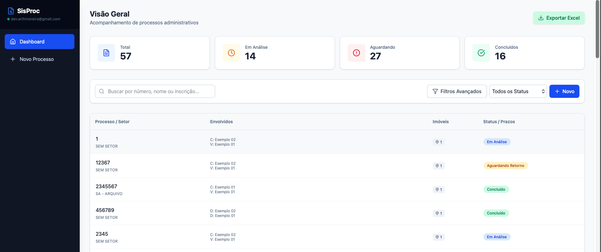
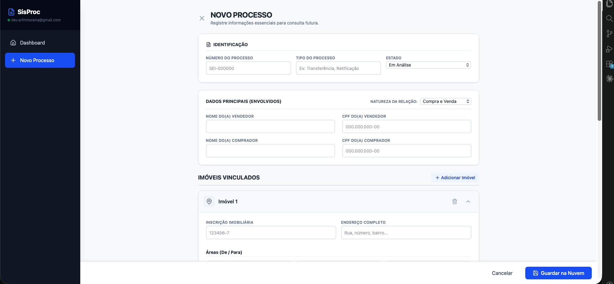
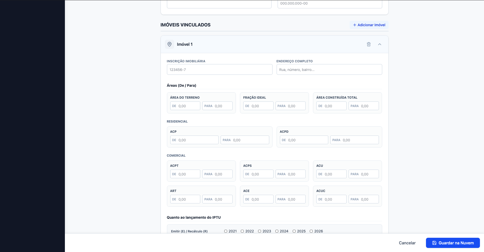
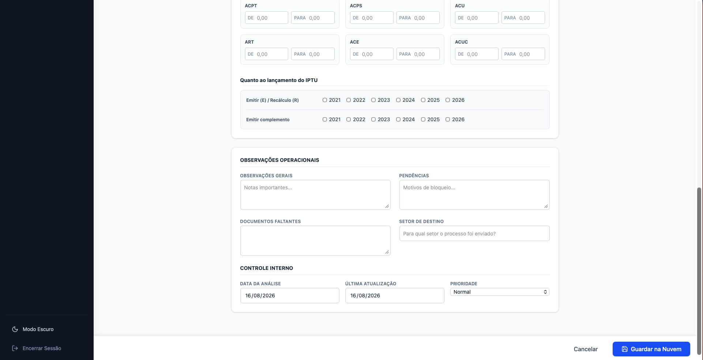

# 🏛️ SisProc - Sistema de Gestão de Processos

O **SisProc** é uma aplicação web desenvolvida para a otimização e controle interno de processos administrativos (como transferências de imóveis, retificações de áreas e lançamentos de IPTU) de uma Prefeitura. 

O sistema substitui o controle manual por uma plataforma em nuvem segura, rápida e com persistência de dados offline para carregamento rápido.

---

## 🎯 Contexto e Motivação

Este projeto nasceu de uma necessidade real e operacional no setor de análise onde atuo na prefeitura da minha cidade. Semanalmente, a nossa equipe recebe cerca de 40 processos complexos para análise quanto ao assunto/pedido do contribuinte. A dinâmica comum é que esses processos acabam precisando ser encaminhados para outros setores e, muitas vezes, demoram uma semana ou mais para retornar. 

Quando retornavam, os analistas perdiam um tempo precioso a ter de reler e revisar toda a documentação do zero para relembrar os detalhes e o estado em que o processo havia parado, principalmente quando é um processo que já possuí diversos anexos/documentos. 

**A Solução:** O SisProc foi criado como uma iniciativa independente (um projeto pessoal e não uma ferramenta institucional oficial) para uso próprio e dos colegas de equipe. Ele atua como um banco de dados rápido na nuvem onde podemos registar o número do processo, pendências e descrições cruciais usando a linguagem técnica que os próprios analistas entendem. 

Ao eliminar horas de retrabalho com a reanálise de documentos, o projeto não só otimizou drasticamente a rotina do setor, como também serve como uma peça prática do meu portfólio, demonstrando o uso da tecnologia para resolver gargalos do mundo real.

---

## ✨ Funcionalidades Principais

- 🔐 **Autenticação Segura:** Acesso restrito via e-mail e senha utilizando Firebase Authentication.
- 📊 **Dashboard & Métricas:** Visão geral rápida do volume de processos e os seus respetivos estados (Em Análise, Aguardando, Concluído, Arquivado).
- ⏰ **Controle de Prazos (SLA):** Alertas visuais automáticos para processos parados "Em Análise" há mais de 15 dias (amarelo) ou 30 dias (vermelho).
- 🔍 **Filtros Avançados:** Pesquisa de textos (número, nome, CPF, inscrição) combinada com filtros por Setor de Destino e Período de Datas.
- 📥 **Exportação para Excel:** Geração de relatórios em formato CSV compatível para fácil leitura em planilhas.
- 🏢 **Gestão de Imóveis Dinâmica:** Capacidade de vincular múltiplos imóveis a um único processo, com detalhamento profundo de áreas (Terreno, Fração, Construída, Residencial, Comercial, etc.) e histórico de recálculo de IPTU.
- 📝 **Histórico de Movimentações:** Timeline interativa para registar despachos, observações e alterações em cada processo.
- 🌓 **Tema Claro/Escuro:** Alternância de tema baseada em Tailwind CSS nativo para conforto visual.

---

## 🚀 Tecnologias Utilizadas

- **Frontend:** React.js (via Vite)
- **Estilização:** Tailwind CSS v4
- **Ícones:** Lucide React
- **Backend/Database:** Firebase Firestore (com suporte nativo a Cache Local)
- **Autenticação:** Firebase Auth

---

---

## 📸 Conheça o Sistema por Dentro

  
   
   
  
   
   
  
   
   
  

---

